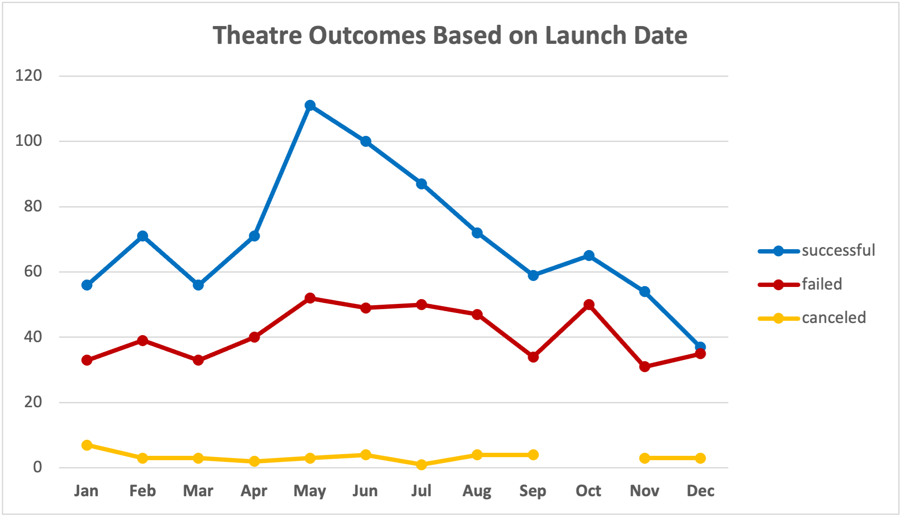
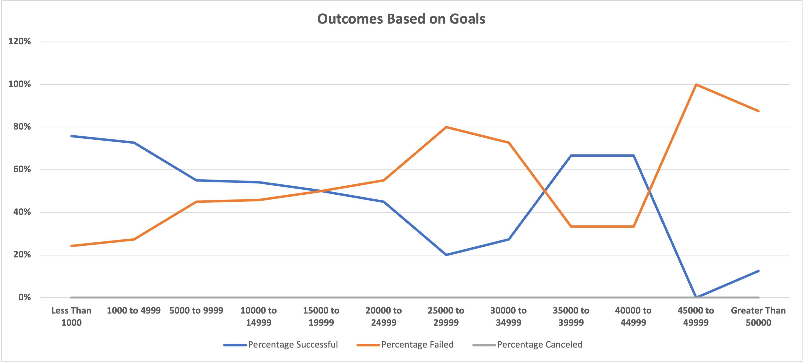

# Kickstarting with Excel

## Overview of Project

### Purpose
An analysis report has been requested to help Louise, a hopeful playwright, plan and budget her Kickstarter campaigns. She is highly interested in developing project campaigns in the theatre category.   

## Analysis and Challenges
Let's start by mentioning that the analysis is based on the Kickstarter dataset, which is available here: [Kickstarter_Challenge](Kickstarter_Challenge.xlsx.zip).

It is noted that Louise’s play "Fever" came close to its fundraising goal in a short amount of time. The challenge is she wants to know how different campaigns fared in relation to their launch dates and their funding goals, which is covered in the following section.

### Analysis of Outcomes Based on Launch Date
From 2009 to 2017, there were a total of 839 successful Theatre campaigns or a 61% success rate from the grand total amount of campaigns created, which were 1,369. On average, there were 93 successful campaigns per year across the 9 years, which covered 21 countries. 

Based on the launch date, more plays were successful in reaching their fundraising goals during the Spring and Summer months. The month of May had the highest success rate with a total of 111 goals achieved, while June was a close second with a total of 100 successful campaigns. These findings are displayed in the line chart below where the blue line represents all successful theatre campaigns.

### Analysis of Outcomes Based on Goals
To further analyze the data that pertains only to the subcategory "Plays", we can determine that, out of 1,047 campaigns, there were 694 campaigns with a successful outcome from 2009 to 2017.

A successful outcome means that a play received monetary pledges that either matched or exceeded its targeted financial goal. 

As shown in the graph below, the blue line displays the percentage of successful Kickstarter campaigns relative to the dollar-amount range. Moreover, we can see that success rates varied largely due to their dollar-amount goals. Dollar-amount ranges of Less Than $1,000 and $1,000 to $4,999 had not only the highest volume of plays, but also generated the highest success rates. Dollar-amount ranges of Less than $1,000 had 186 total projects with a 76% success rate, or 141 successful plays. Dollar-amount ranges between $1,000 and $4,999 had 534 total projects with a 73% success rate, or 388 successful plays.    

### Challenges and Difficulties Encountered

One of the biggest challenges for Louise is the timing of her Kickstarter campaigns. For only one quarter of the year, the level of interest is high among pledgers for plays. This narrows down the chances of achieving her goals year-round. Ideally, Louise would get a better understanding of the people donating towards the plays and see if she is able to retain them or increase interest in other seasons besides the Spring and Summer.

The difficulties in these plays are not just on the timing but on the monetary goal as well. Kickstarter campaigns with goals above $5,000 have about a 50% chance of achieving its goal. Louise would have to revisit each goal and have a realistic approach when starting a Kickstarter campaign. 

## Results

- What are two conclusions you can draw about the Outcomes based on Launch Date?

For Louis to achieve success in her plays’ Kickstarter campaigns, the timing is critical. As stated earlier, the months of May and June showed higher success rates, and this can guide Louise to better plan her campaigns throughout the year. Perhaps she can consider a strong marketing plan or an advertising promotion during the fall and winter months to generate as many pledges and interest in theatre from backers as possible.

Additionally, if Louise were to focus on a higher dollar target Kickstarter campaign (i.e., >$5,000), she should execute these in the months of May or June. While higher dollar target campaigns are generally less successful, if done in May or June, the likelihood of success is much higher.

- What can you conclude about the Outcomes based on Goals?

Kickstarters for plays that have conservative goals such as less than $5,000 dollars are 74% more likely to reach their financial goals. The average number of backers per successful campaign was 56 with an average of $80 dollars per backer. With that said, perhaps Louise should think of extending the number of months to request financial pledges to improve the chances of a better outcome on her campaigns, especially the ones with goals higher than $5,000.

- What are some limitations of this dataset?

This dataset does have some limitations in which no additional information was provided that can describe further business efforts that were done or considered. The data is solely based on efforts from Kickstarter campaigns, and the pledges received throughout the 9 years. As such, we may not see the whole picture in this dataset. 

- What are some other possible tables and/or graphs that we could create?

For this analysis, we could create a bar chart that can depict months and dollar-amount ranges for specific subcategories such as musicals and plays to see how they compare overall. However, a line chart is well utilized in this analysis as we are looking to display trends of the Kickstarter dataset that changes over time and across various dollar-amount targets.
