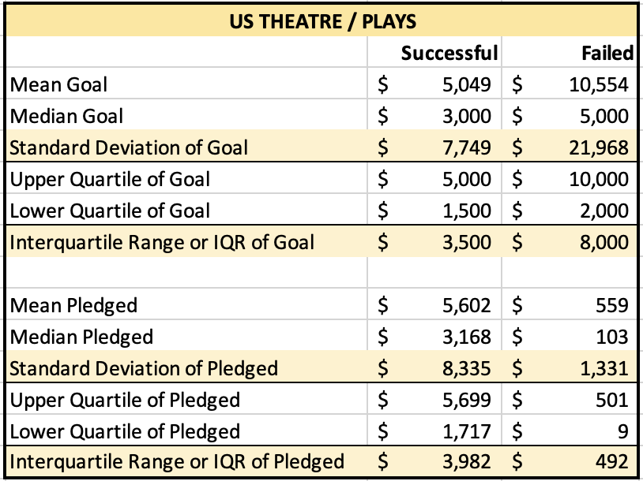
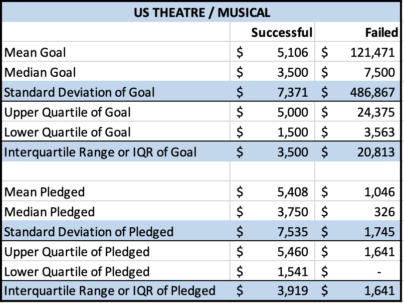
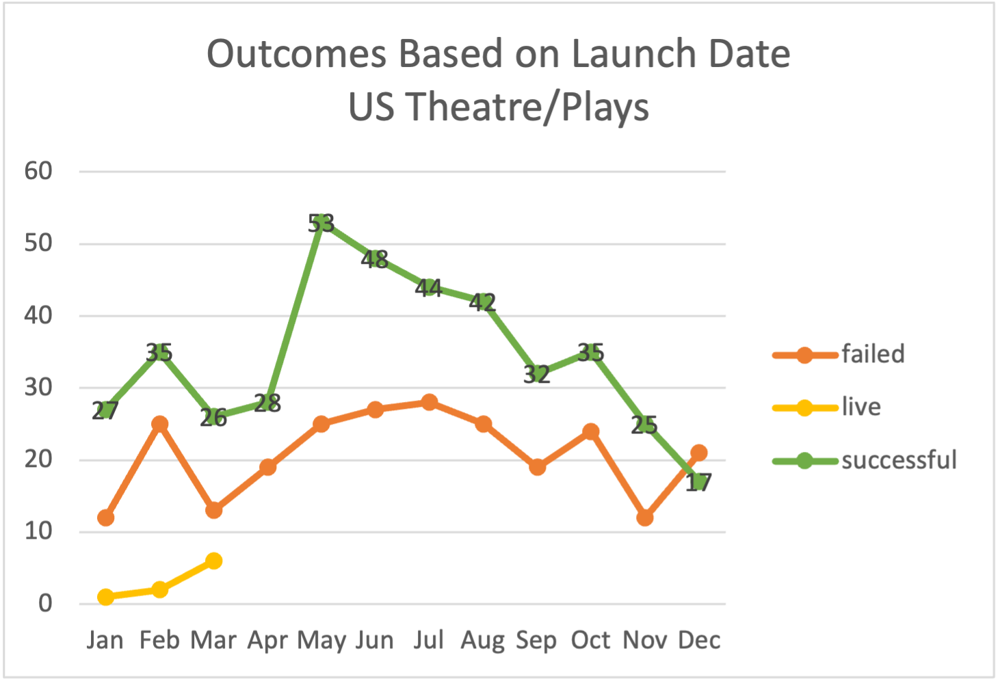
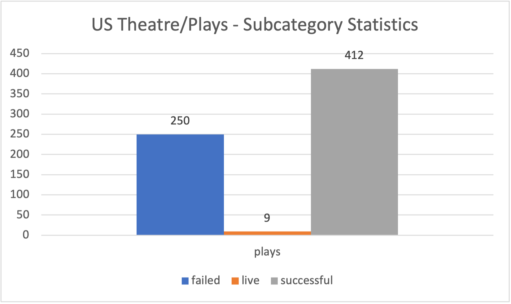
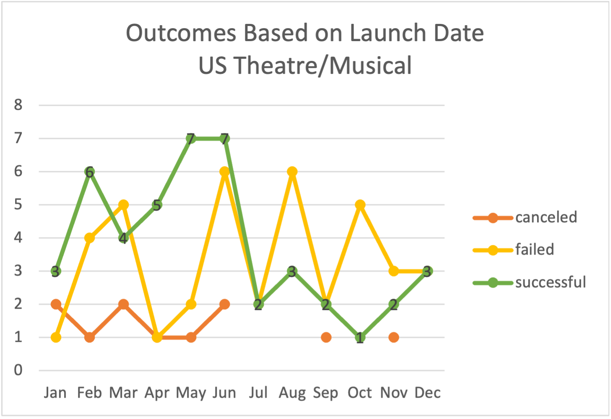
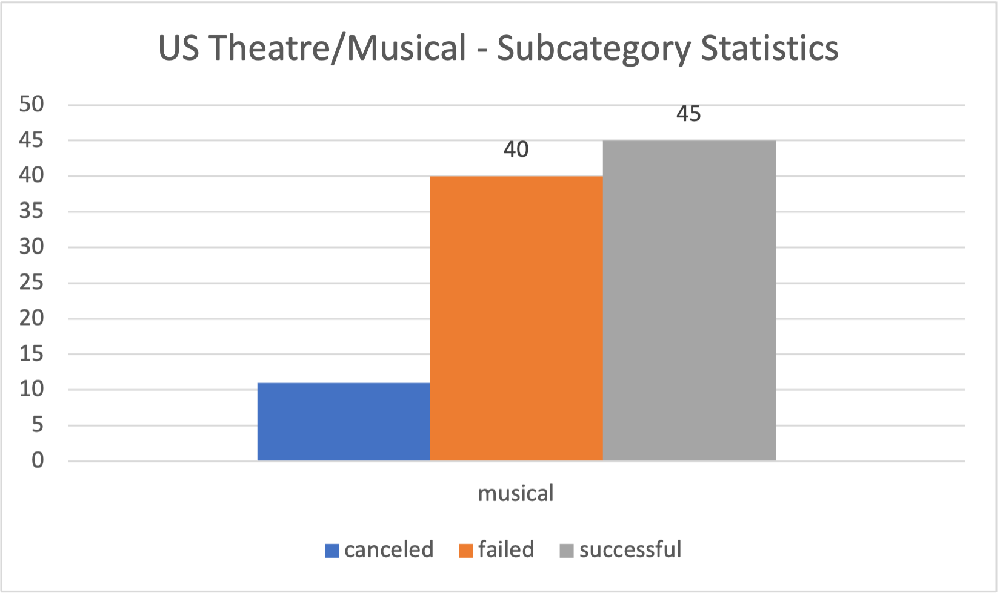

# An Analysis of Kickstarter Campaigns

## Overview of Project

### Purpose

An analysis report has been requested to help Louise, a hopeful playwright, plan and budget her project campaigns, specifically in theatre. The analysis is based on the Kickstarter data, which has been narrowed down to focus on the US market. 

Based on these descriptive statistics in the US market, the following can be determined:

* The mean of each distribution is around the 3rd quartile, so the data follows similar distributions in each subset for Theatre/Plays and Theatre/Musical.
* Some large values are driving all of these distributions. The standard deviations are all roughly twice the IQR in each distribution, except in the failed Kickstarters, where the standard deviation is closer to three times the IQR for Theatre/Plays and closer to 23 times the IQR for Theatre/Musical. 

* As shown in the graph below, the green line displays the number of successful plays per month. You can see more plays were successful in reaching their goal during the Spring and Summer months. The month of May had the highest successful plays with a total of 53.

* Looking at the green line in the respective graph chart, you can see more musicals were successful in reaching their goal during the Spring and Summer months as well. May and June had the highest successful musicals with a total of 7 per month. 

* Quick facts: The top failed Kickstarter in Theatre/Plays and Theatre/Musical with a high goal and low pledge are as follows:
* Play Title: "CONVERSATIONS WITH AN AVERAGE JOE" had a set goal of $180,000 dollars, while only $20 dollars were pledged from one single backer and given one month to reach the set goal. 
* Musical Title: "Our Modern Lives" had a set goal of $3,000,000 dollars, while only $1,800 dollars were pledged from six backers and given two months to reach the set goal. 

Louise is very interested in developing project campaigns in the theatre category while considering between plays and musicals. By focusing on the US market, we recommend pursuing campaigns with conservative goals such as $1,500 to $5,000 dollars in either sub-category. Louise should also think of extending the number of months to request pledges to improve the chances of a better outcome on campaigns with much larger goals. Lastly, the timing on these projects is critical for their success. Think of pushing a strong marketing campaign during the Spring and Summer months to generate as much pledges as possible. 

